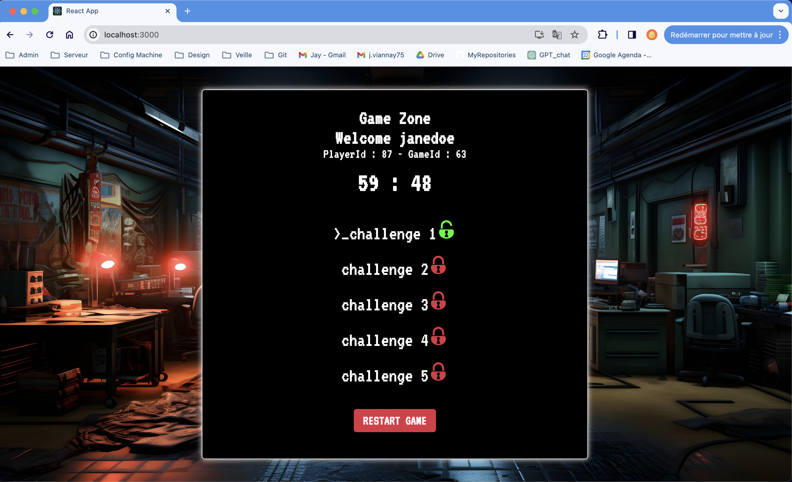
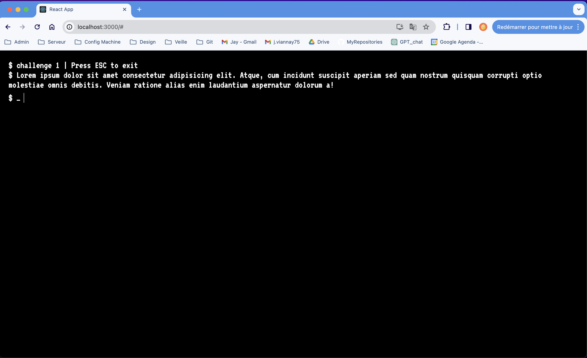
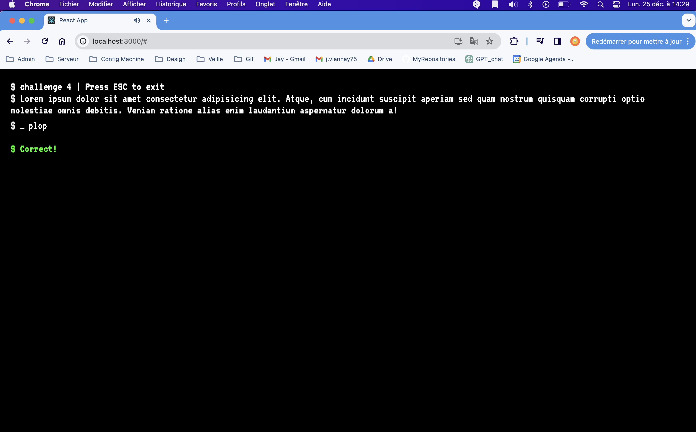
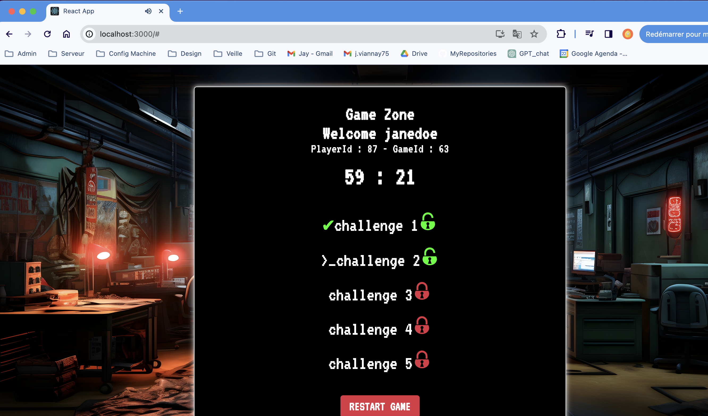
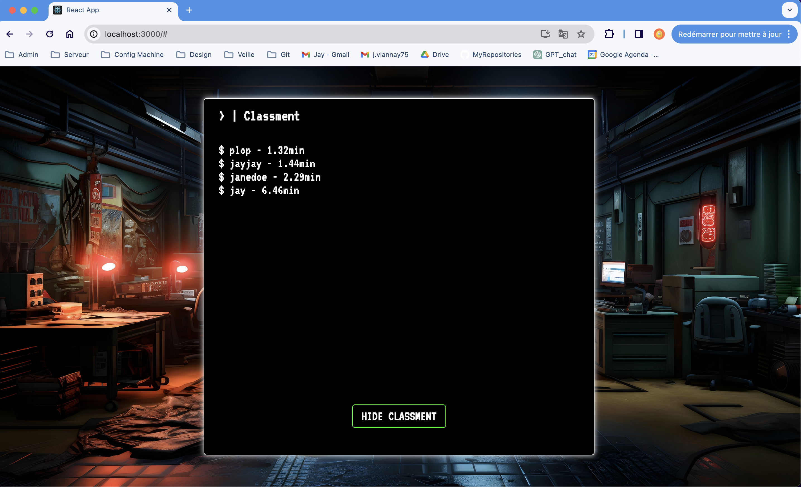

## React App Escape Game

This is a React App Escape Game. The goal is to escape the room by resolving the challenges.

### Installation
- Clone this repository
- Install the Server : follow instructions in the server-escape-game/README.md's file
- Open a terminal in the root folder of the project
- Run `npm install`
- Run `npm start`
- Go to `http://localhost:3000/`
- Enjoy !

### Technologies
- React
- Node.js
- Express
- MySQL
- Axios
- Flexbox
- HTML5 / CSS3

### How to play
- You have to resolve the challenges to escape the room
- Follow the instructions on the screen

### Screenshots

